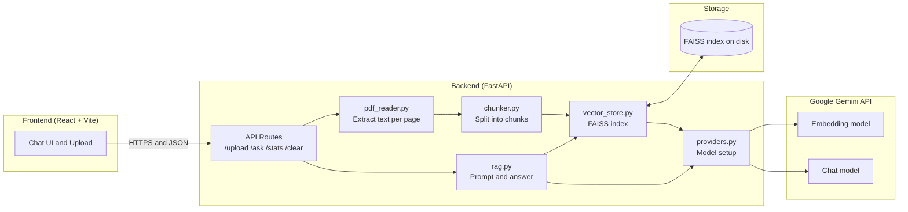
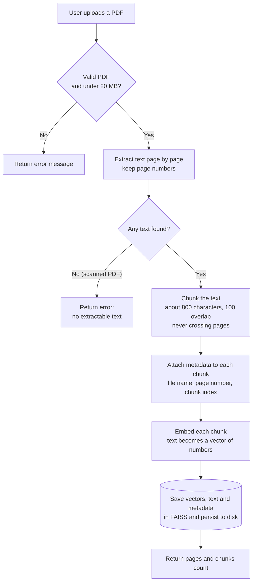
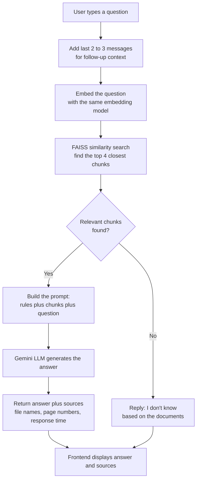
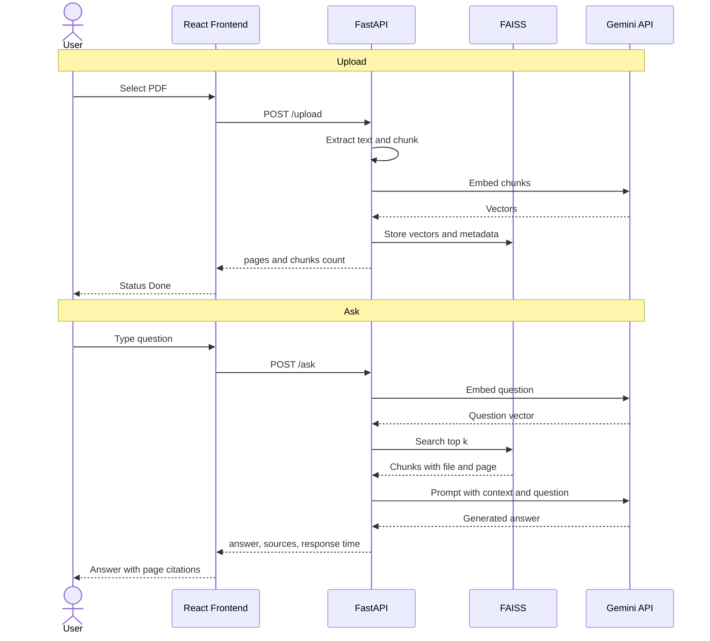

# 📄 PDF Chatbot (RAG)

Chat with your PDFs. Upload one or more documents, ask questions in plain language, and get answers grounded **only** in the document content, with the **file name and page number** of every source so you can verify them.

---

## Table of contents

1. [What it does](#what-it-does)
2. [The problem and the solution](#the-problem-and-the-solution)
3. [System architecture](#system-architecture)
4. [How it works: flowcharts](#how-it-works-flowcharts)
5. [Request sequence](#request-sequence)
6. [Tech stack](#tech-stack)
7. [Project structure](#project-structure)
8. [Key design decisions](#key-design-decisions)
9. [API reference](#api-reference)
10. [Local setup](#local-setup)
11. [Deployment](#deployment)
12. [Evaluation method](#evaluation-method)
13. [Limitations and future work](#limitations-and-future-work)

---

## What it does

- Upload one or multiple PDFs
- Ask questions in a chat interface
- Answers come only from your documents; if the answer is not there, the bot says it doesn't know
- Every answer shows its sources (file name and page number) and the response time
- Follow-up questions work because the last few messages are included as context
- The index is saved to disk, so it survives a server restart
- Works on desktop and mobile

## The problem and the solution

**Problem:** An LLM does not know what is inside your PDF, and you cannot paste a 200-page document into every question. It is slow, expensive, and often exceeds the model's context limit.

**Solution:** **RAG (Retrieval-Augmented Generation).** First *retrieve* only the few passages relevant to the question, then give just those passages to the LLM to *generate* the answer.

| Benefit | How |
|---|---|
| Fewer hallucinations | The LLM is instructed to answer only from the retrieved context |
| Low cost and fast | Only 3 to 5 small chunks are sent to the LLM, not the whole PDF |
| Trustworthy | Each answer cites the file and page it came from |
| Always up to date | New documents are added by indexing, with no model retraining |

---

## System architecture



**Layers in one line each**

- **Frontend:** collects the PDF and the question, and displays the answer with sources.
- **API layer:** validates input, routes requests, handles errors and CORS.
- **Processing layer:** turns a PDF into searchable chunks.
- **Vector store:** finds chunks by meaning, not by keywords.
- **RAG layer:** builds the prompt and asks the LLM.
- **Provider layer:** the only place that knows about Gemini, so switching to OpenAI means changing one file.

---

## How it works: flowcharts

### Phase A: Indexing (once per PDF)



### Phase B: Answering (every question)



### End-to-end in one line

```
PDF → text → chunks → embeddings → vector store
Question → embedding → search store → top chunks → LLM → answer + page numbers
```

---

## Request sequence



---

## Tech stack

| Layer | Technology | Purpose |
|---|---|---|
| Frontend | React, Vite, CSS | Chat UI, upload, source display |
| Backend | Python, FastAPI | REST API, validation, CORS |
| Orchestration | LangChain | Splitting, embeddings, vector store glue |
| PDF parsing | pypdf | Page-by-page text extraction |
| Vector store | FAISS (faiss-cpu) | Fast similarity search |
| AI models | Google Gemini | Embeddings and answer generation |
| Hosting | Vercel (frontend), Render (backend) | Free-tier deployment |

---

## Project structure

```
pdf-rag-chatbot/
├── backend/
│   ├── app/
│   │   ├── main.py          # FastAPI app, routes, CORS
│   │   ├── pdf_reader.py    # Extract text per page
│   │   ├── chunker.py       # Split text, keep metadata
│   │   ├── vector_store.py  # FAISS: add, search, save, load, reset
│   │   ├── rag.py           # Prompt building and answer generation
│   │   ├── providers.py     # LLM and embedding model setup
│   │   └── config.py        # Settings from environment variables
│   ├── tests/
│   ├── requirements.txt
│   └── .env.example
├── frontend/                # Vite + React app
└── README.md
```

---

## Key design decisions

**Chunk size and overlap.** Chunks of about 800 characters with 100 overlap. Smaller chunks give precise but sometimes incomplete answers; larger chunks give more context but vaguer retrieval. Chunk size and overlap are configurable so different values can be compared.

**Chunks never cross pages.** This keeps page citations accurate.

**Grounded prompt.** The prompt tells the model to answer using only the provided context and to say it doesn't know otherwise:

```
Answer using only the context below.
If the answer is not in the context, say you don't know.

Context:
{retrieved chunks}

Question: {question}
```

**Semantic search, not keyword search.** Text is converted to vectors, so a question like "how do I get my money back?" can match a passage about "refund policy" even though they share no words.

**Provider isolation.** All model-specific code lives in `providers.py`, so swapping Gemini for OpenAI is a one-file change.

**Why RAG instead of fine-tuning?** RAG needs no training, updates instantly when documents change, and can cite its sources. Fine-tuning bakes knowledge into the model, which is costly, hard to update, and cannot point to where an answer came from.

**Secrets.** API keys are read from environment variables and never committed to the repository.

---

## API reference

Interactive docs are available at `/docs` when the server is running.

| Method | Endpoint | Description |
|---|---|---|
| `POST` | `/upload` | Upload a PDF (max 20 MB). Returns pages and chunks indexed. |
| `POST` | `/ask` | Body: `{"question": "..."}`. Returns answer, sources, response time. |
| `GET` | `/stats` | Documents, pages, and chunks currently indexed. |
| `POST` | `/clear` | Reset the index. |

**Example `/ask` response**

```json
{
  "answer": "The refund window is 30 days from the date of purchase.",
  "sources": [
    { "file_name": "policy.pdf", "page_number": 4 },
    { "file_name": "policy.pdf", "page_number": 5 }
  ],
  "response_time_seconds": 2.1
}
```

---

## Local setup

**Prerequisites:** Python 3.10+, Node.js 18+, and a free API key from [Google AI Studio](https://aistudio.google.com).

### 1. Get the code

Clone this repository and open the project folder in a terminal.

### 2. Backend

```bash
cd backend
python -m venv venv
source venv/bin/activate        # Windows: venv\Scripts\activate
pip install -r requirements.txt
cp .env.example .env            # then add your key
```

Edit `.env`:

```
GEMINI_API_KEY=your_key_here
ALLOWED_ORIGINS=http://localhost:5173
```

Run the server:

```bash
uvicorn app.main:app --reload
```

Open http://localhost:8000/docs to test the API.

### 3. Frontend

```bash
cd frontend
npm install
echo "VITE_API_URL=http://localhost:8000" > .env
npm run dev
```

Open http://localhost:5173.

---

## Deployment

**Backend (Render)**
1. Create a new Web Service from this repository with root directory `backend`.
2. Build command: `pip install -r requirements.txt`
3. Start command: `uvicorn app.main:app --host 0.0.0.0 --port $PORT`
4. Add `GEMINI_API_KEY` and `ALLOWED_ORIGINS` (the frontend URL) as environment variables.

**Frontend (Vercel)**
1. Import the repository with root directory `frontend`.
2. Add `VITE_API_URL` set to the deployed backend URL.

**Notes**
- On Render's free tier the server sleeps after inactivity, so the first request can take 30 to 60 seconds.
- Files on disk can be lost when the service restarts or redeploys. For permanent storage, use a persistent disk or a hosted vector database.

---

## Evaluation

The repository includes an automated evaluation harness (`backend/eval/run_eval.py`) to systematically measure retrieval accuracy, answer fidelity, refusal behavior, and latency against ground-truth document questions.

### How to run the evaluation

1. **Start the backend server** in one terminal:
   ```powershell
   cd backend
   .venv\Scripts\Activate.ps1
   uvicorn app.main:app --reload --port 8000
   ```

2. **Verify questions** in `backend/eval/questions.json`:
   - Inspect the `expected_file`, `expected_pages`, and `expected_keywords` for each question.
   - Flip `"verified": true` for the questions you want to score (unverified items are skipped by default).

3. **Execute the evaluation harness** in a second terminal:
   ```powershell
   cd backend
   .venv\Scripts\Activate.ps1
   python eval/run_eval.py
   ```
   *Optional flags:*
   - `--sleep 4.0`: Seconds to pause between queries (default 4s to avoid free-tier rate limits).
   - `--api-url http://localhost:8000`: Backend URL.
   - `--all`: Run all questions in `questions.json` regardless of the verified flag.

### Metrics explained

- **Retrieval Hit Rate:** The percentage of answerable and multi-hop questions where at least one retrieved chunk returned in `sources` matches the correct `expected_file` and one of the `expected_pages`.
- **Keyword Answer Score:** The average percentage of ground-truth keywords found (case-insensitive) in the generated answer text for answerable and multi-hop queries.
- **Refusal Rate (Unanswerable):** The percentage of out-of-domain / unanswerable questions where the model properly identifies that the information is absent and refuses to hallucinate (e.g., stating "I don't know" or "not mentioned in the context").
- **Latency Breakdown:** The mean, median, and 95th-percentile (P95) of total roundtrip response time (`response_time_seconds`), along with separate mean durations for chunk retrieval (`retrieval_seconds`) and LLM generation (`llm_seconds`).

### Evaluation Results (Placeholder)

*Run `python eval/run_eval.py` after verifying ground-truth questions to populate these metrics.*

| Metric | Target | Measured Result |
|---|---|---|
| **Retrieval Hit Rate** | ≥ 90% | *[Pending evaluation run]* |
| **Keyword Answer Score** | ≥ 85% | *[Pending evaluation run]* |
| **Refusal Rate (Unanswerable)** | 100% | *[Pending evaluation run]* |
| **Mean Response Time** | < 3.0s | *[Pending evaluation run]* |
| **Median Response Time** | < 2.5s | *[Pending evaluation run]* |
| **P95 Response Time** | < 5.0s | *[Pending evaluation run]* |
| **Mean Retrieval Time** | < 0.3s | *[Pending evaluation run]* |
| **Mean LLM Generation Time** | < 2.5s | *[Pending evaluation run]* |

Run outputs and raw query-by-query audit logs are automatically persisted to timestamped files under `backend/eval/results/results_<timestamp>.json`.

---

## Limitations and future work

**Current limitations**
- Scanned (image-only) PDFs contain no extractable text, so they are rejected with a clear error.
- Free-tier hosting means a slow first request after inactivity.
- A local FAISS index suits a handful of documents, not thousands.

**Future improvements**
- OCR support for scanned PDFs
- Re-ranking retrieved chunks for better accuracy
- Hosted vector database (such as Pinecone) to scale to thousands of documents
- Streaming answers token by token
- User accounts with separate document libraries
